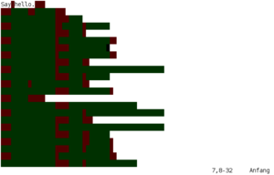
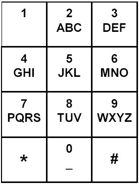

# CTF Candy

## Web
Web challenges can often by tricky. Sometimes you have no clue what to do.
A good recommendation is try to find stuff that is out of the ordinary.

A good clue where to start is to look out for:
* GET parameters.
    `?page=index`

    Here you have to manually try to enter some stuff to understand more about the application.
    * `?id='` => SQL error, okay probably a sql injection. ID are often sql injections
    * `?page[]=` => Send an array, this might crash or reveal debug information about the error. Sometimes you might even get the source code of the application.
    * `?id=-1` => Try negative numbers
    * `?page=../../../../etc/passwd` => LFI
    * `?page=../html/index` => If you the above line does not work. Try this as you could be dealing with a limited local file inclusion.
        ```php
        <?php
            include $_GET['page'] . '.php';
        ```
    * `?page=http://remote-file.js` => RFI

    * `?page=%252e%252e%252fetc%252fpasswd` => Double encoding + LFI

    * `$ curl -d "AAAA1234" -X POST http://URL/?magic=php://input` => If you see AAAA1234 in the data => LFI using PHP Wrappers.
* Hidden form input
    ```html
    <input type="hidden" name ="debug" />
    ```
    I would try the same stuff as the GET parameter previously described. Also:
    * Try enter `5*5`. If it returns `25` =>  `command injection`.


* Commented out links
    ```html
    <!-- <a href="Secret/admin.html"></a> -->
    ```
* Keywords in comments
    ```
    <!-- debug -->
    ```
* [File upload](https://www.owasp.org/index.php/Unrestricted_File_Upload)
    * Try a lot of different extensions'
    * Double extension `.png.php`
    * `command injecton` in filename
    * Add PHP code to gif
    ```bash
    gifsicle < mygif.gif -- comment "<?=phpversion();?>" > output.php.gif
    ```

* Money transfer => These are often a `timing attack`

* Clues in the name/title of the challenges

* Clues in the description of the challenge

* /robots.txt

* Append `?debug=1` or `?is_debug=1` to the url

        This will sometimes give you the source code of the page.
        You should test the code locally. Or some parts of the code that you do not understand. Your goal is to understand how to circumvent each layer of the challenge.

* Interesting headers sent by the application

* Cookies

* PHP Version?

* Apache/nginx version?

* Nullbyte

* LFI / RFI (PHP Wrappers) => I recommend this page from [rawsec](https://rawsec.ml/en/local-file-inclusion-remote-code-execution-vulnerability/)

##### Well.. I've found nothing

If you have not found something by now. You may want to run a fuzzer.

1. Grab yourself a good [fuzz.txt](https://github.com/Bo0oM/fuzz.txt)

Use your favorite `fuzzer`. Here are some good ones:

* dirb

* dirbuster


## Useful tools for web

* ZAP
* Burpsuite


## Esoteric Languages (ESO Lang)
* https://esolangs.org/wiki/language_list

        Esoteric programming languages wiki! Great resource

* https://tio.run/

        "Tio is a online interpreters for an evergrowing list of practical and recreational programming languages."

* [https://esolangs.org/wiki/Hello_world](https://esolangs.org/wiki/Hello_world_program_in_esoteric_languages)

        This is a good resource to find examples of a lot of esoteric languages.

### Examples of common esolangs

* [Brainfuck](https://www.dcode.fr/brainfuck-language)

        ```
        ++++++++++[>+>+++>+++++++>++++++++++<<<<-]>>>>.<---.>+++++++++++.-----------.+.<<++.>-.>+++++++++++++.-----------------.++++++++.+++++.--------.+++++++++++++++.------------------.++++++++.
        ```

* [Malbogne](http://www.malbolge.doleczek.pl/)

        ```(=<`#9]~6ZY32Vx/4Rs+0No-&Jk)"Fh}|Bcy?`=*z]Kw%oG4UUS0/@-ejc(:'8dc```

* [Piet](https://www.bertnase.de/npiet/npiet-execute.php)

    

* [JSFuck](http://codertab.com/JsUnFuck)

    [][(![]+[])[+[]]+([![]]+[][[]])[+!+[]+[+[]]]+(![]+[])[!+[]+!+[]]+(!![]+[])[+[]]+(!![]+[])[!+[]+!+[]+!+[]]+(!![]+[])[+!+[]]][([][(![]+[])[+[]]+([![]]+[][[]])[+!+[]+[+[]]]+(![]+[])[!+[]+!+[]]+(!![]+[])[+[]]+(!![]+[])[!+[]+!+[]+!+[]]+(!![]+[])[+!+[]]]+[])[!+[]+!+[]+!+[]]+(!![]+[][(![]+[])[+[]]+([![]]+[][[]])[+!+[]+[+[]]]+(![]+[])[!+[]+!+[]]+(!![]+[])[+[]]+(!![]+[])[!+[]+!+[]+!+[]]+(!![]+[])[+!+[]]])[+!+[]+[+[]]]+([][[]]+[])[+!+[]]+(![]+[])[!+[]+!+[]+!+[]]+(!![]+[])[+[]]+(!![]+[])[+!+[]]+([][[]]+[])[+[]]+([][(![]+[])[+[]]+([![]]+[][[]])[+!+[]+[+[]]]+(![]+[])[!+[]+!+[]]+(!![]+[])[+[]]+(!![]+[])[!+[]+!+[]+!+[]]+(!![]+[])[+!+[]]]+[])[!+[]+!+[]+!+[]]+(!![]+[])[+[]]+(!![]+[][(![]+[])[+[]]+([![]]+[][[]])[+!+[]+[+[]]]+(![]+[])[!+[]+!+[]]+(!![]+[])[+[]]+(!![]+[])[!+[]+!+[]+!+[]]+(!![]+[])[+!+[]]])[+!+[]+[+[]]]+(!![]+[])[+!+[]]]((![]+[])[+!+[]]+(![]+[])[!+[]+!+[]]+(!![]+[])[!+[]+!+[]+!+[]]+(!![]+[])[+!+[]]+(!![]+[])[+[]]+(![]+[][(![]+[])[+[]]+([![]]+[][[]])[+!+[]+[+[]]]+(![]+[])[!+[]+!+[]]+(!![]+[])[+[]]+(!![]+[])[!+[]+!+[]+!+[]]+(!![]+[])[+!+[]]])[!+[]+!+[]+[+[]]]+[+!+[]]+(!![]+[][(![]+[])[+[]]+([![]]+[][[]])[+!+[]+[+[]]]+(![]+[])[!+[]+!+[]]+(!![]+[])[+[]]+(!![]+[])[!+[]+!+[]+!+[]]+(!![]+[])[+!+[]]])[!+[]+!+[]+[+[]]])()

* [Whitespace](https://vii5ard.github.io/whitespace/)

    

* [Emojicode](https://www.emojicode.org/docs/guides/install.html)

        🏁 🍇
        😀 🔤Hey!🔤❗️
        🍉

* [Befunge-93](http://www.quirkster.com/iano/js/befunge.html)

        2>:3g" "-!v\  g30          <  |!`"O":+1_:.:03p>03g+:"O"`|  @               ^  p3\" ":<
* [Ook]()

        Ook. Ook? Ook. Ook. Ook. Ook. Ook. Ook. Ook. Ook. Ook. Ook. Ook. Ook. Ook. Ook.
        Ook. Ook. Ook. Ook. Ook! Ook? Ook? Ook. Ook.

    Could also be written without the Ook
        . ? . . . . . ! .

## Steganography

* stegsolve.jar

* Steghide

* StegCracker

* openstego

* stegoVeritas

* stegdetect

* stegbreak

* zsteg

* jsteg

* jstego

* gimp

* Outguess

* steganabara

* stegspy

* photoshop
        Make sure you zoom and check every pixel. Sometimes it's hidden in plain sight.
* zbarimg (QR Code)
        Usage: zbarimg image.png

* cloackedpixel

* LSBSteg

* f5

### Audio Steganography

* [DTFM Tones](http://dialabc.com/sound/detect/index.html)

* SONIC Visualizer

* [SSTV](http://users.belgacom.net/hamradio/rxsstv.htm)

* mp3stego

* spectrology

### Other techniques

        * Reverse image search for original images
        * XOR original image
        * compare original.png challenge.png

### What to look out for

    * Anomalies
    * Repetitive patterns
    * Positive and negative numbers could be binary (0, 1).
    * Binary code could be morse code
    * Morse code
        - Also check for nonstandard delimiter


## JPEG forensics

* `identify chall.jpg`

* `jhead chall.jpg`

* `jpeginfo chall.jpg`

* `rdjpgcom -verbose chall.jpg`

## PNG Forensics

* pngcheck

        pngcheck -vt7f image.png

* pngcsum

    If you have a corrupt png (CRC32 checksum for example) this tool can fix it without having to open a hexeditor.

        pngcsum broken.png new.png

* pngcrush

* pngchunks

        Usage: pngchunks chall.png

* pngfix

        Usage: pngfix chall.png


* pnginfo

        Usage: pnginfo chall.png

* pngsplit

        Usage:  pngsplit chall.png

#### The Animated Portable Network Graphics (APNG) file format

* [APNG Disassembler 2.9](http://apngdis.sourceforge.net)

        Usage: apngdis anim.png [name]

* [TweakPNG](http://entropymine.com/jason/tweakpng/)

    

        Usage: wine tweakpng.exe


# Cryptography

* Old phone keypad

    

* [Keyboard shift decoder](https://www.dcode.fr/keyboard-shift-cipher)

        gwkki -> hello (shift one key to the right)

* Bit shifted characters

        ord("A") = 65
        65 << 1 = 130 (encode)
        130 >> 1 = 65 (decode)

* Reverse text

        $ echo "dlrow olleh" | rev
        hello world
* [254caesar](https://github.com/flawwan/254caesar)

        echo -n "String to shift" | ./caesar

* [QuipQuip](https://quipqiup.com/)

        Sometimes you can get lucky with Quip and recover parts or even the complete flag.
        Tips:
        - Use CLUES
        - Try all modes

## Forensics

* strings

    Running strings on a binary can often reaval the flag. Use in conjunction with grep
        $ strings binary | grep "CTF_CHALL"
        $ strings binary | grep `echo -n "CTF_CHALL" | base64`

* exiftool


# Magic bytes

| Type        |  Recognize      | Signature  |
| ------------- |:-------------:| ----------:|
| EXE           |   MZ        |  4D 5A      |
| GIF           |   GIF87a        |  47 49 46 38 37 61|
| GIF           |   GIF89a        |  47 49 46 38 39 61      |
| JPG           |   ÿØÿà..JFIF..  |  FF D8 FF E0 00 10 4A 46 49 46 00 01       |
| PNG           |   .PNG....        | 89 50 4E 47 0D 0A 1A 0A      |
| PDF           |   %PDF-        |  25 50 44 46 2d     |
| 7z            |   7z¼¯'        |  37 7A BC AF 27 1C      |

## Other (Unsorted, todo)

* Samba tool [pdbedit](https://www.samba.org/samba/docs/current/man-html/pdbedit.8.html)

* [impacket](https://github.com/SecureAuthCorp/impacket)

* [any.run](https://app.any.run/)

* [ViperMonkey](https://github.com/decalage2/ViperMonkey)

* [oletools](https://github.com/decalage2/oletools)

* /dev/random - Might sometimes return nullbyte(\00)


Sources of inspiration:
* https://github.com/JohnHammond/ctf-katana/blob/master/README.md
* https://github.com/USCGA/tools
* https://ctftime.org/writeup/12243
* https://github.com/DominicBreuker/stego-toolkit#tools
* https://en.wikipedia.org/wiki/List_of_file_signatures
